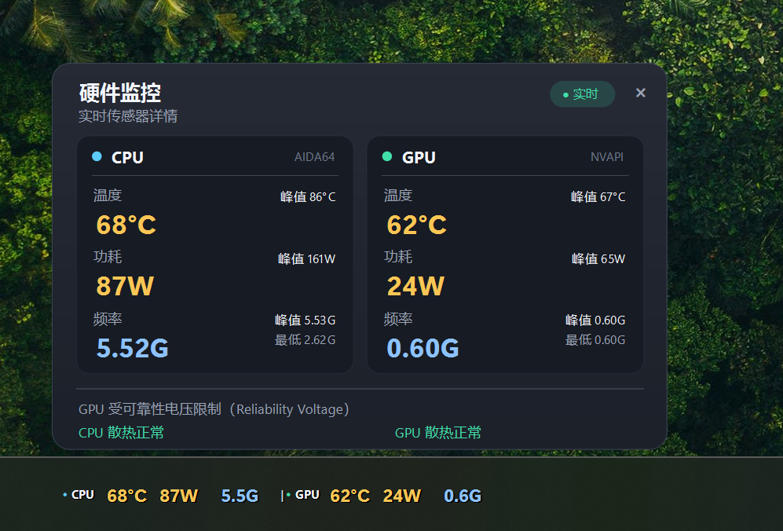

# WindowsMonitor 硬件监控

一个轻量的 Windows 桌面监控应用，**在任务栏上实时显示 CPU 与显卡的温度、功耗、频率**，点击弹出详细数据卡，绿色免安装，双击即用。



- 技术栈：C# + WinForms（.NET Framework 4.8，系统自带编译器编译，**无需安装任何 SDK / 运行时**）
- 运行环境：Windows 10 / 11 x64（4K / 高 DPI 屏适配）
- 数据来源：
  - **CPU**：AIDA64 共享内存（`AIDA64_SensorValues`，AIDA64 的 HVCI 兼容内核驱动采集，本程序只读内存映射，无需任何内核驱动）
  - **GPU**：LibreHardwareMonitor（0.9.6，走 NVIDIA NVAPI 用户态接口）

## 快速使用

1. 打开 **AIDA64 → 文件 → 设置 → 硬件监控 → 外部应用**，勾选 **启用共享内存**，确定
2. **保持 AIDA64 常驻运行**（最小化即可）
3. 双击 `WindowsMonitor.exe`，UAC 弹窗点"是"
4. 监控条会**直接嵌入任务栏**（在开始按钮旁边），数据每秒实时刷新

> ⚠️ 程序需要**管理员权限**（首次启动会弹出 UAC 确认框，点"是"）。GPU 功耗/频率经 NVIDIA API 读取，需要管理员权限。

## 任务栏显示（核心功能）

- **直接嵌入任务栏**（成为任务栏的一部分，不是悬浮窗）：任务栏在它就在，任务栏隐藏（全屏游戏/视频）它跟着隐藏，不会遮挡、不会闪烁、不会消失
- **点击弹出详情卡**：显示 CPU / GPU 的当前值、最大值、最小值，以及 GPU 降频原因（散热限制 / 功耗墙 / 电压限制等）和散热健康判断（用于排查因散热导致的降频降功耗）
- **按住拖动**：可以在任务栏上左右移动监控条的位置，位置自动记忆，重启后保持
- **开始菜单避让**：打开开始菜单/搜索面板时自动让开，关闭后归位
- **悬停不变色**：鼠标悬停时样式保持不变，不重绘、不闪烁

## 功能

| 面板 | 温度 | 功耗 | 频率 | 数据来源 |
|------|------|------|------|----------|
| CPU | ✓ | ✓ | ✓ | AIDA64 共享内存 |
| GPU（NVIDIA / AMD / Intel） | ✓ | ✓ | ✓ | LibreHardwareMonitor / NVAPI |

- 每 1 秒刷新一次
- 温度按数值自动变色（绿 < 60°C < 黄 < 80°C < 红）
- 自动识别 Intel / AMD CPU，NVIDIA / AMD / Intel 显卡，NVIDIA 优先于核显
- **最小化到系统托盘**：点最小化或关闭窗口都会收进任务栏右侧托盘，托盘图标悬停显示实时数值，双击恢复窗口，右键可退出
- Win11 风格深色界面（圆角窗口、深色标题栏、Segoe UI Variable 字体）

## 为什么 CPU 用 AIDA64 而不是直接读？

开启 Windows **内存完整性**（HVCI，内核隔离）时，Windows 会拦截 WinRing0 这类老式内核驱动，
而 AIDA64 使用了自己开发并通过 HVCI 合规认证、正式签名的内核驱动，所以它能读到 CPU 数据。
本程序通过 AIDA64 官方提供的共享内存接口读取同一份数据，因此**无需关闭内存完整性**。

如果 AIDA64 未运行/未启用共享内存，CPU 面板会显示提示文字和 `--`；显卡读数不受影响。

## 目录结构

```
WindowsMonitor.exe          主程序（绿色版，双击运行）
WindowsMonitor.exe.config   程序集绑定重定向
*.dll                       运行时依赖（LibreHardwareMonitor 及其依赖）
src\                        源代码（C#，可用系统自带编译器重新编译）
lib\                        SDK 引用用 DLL（编译时使用）
```

## 重新编译（无需安装任何东西）

Windows 系统自带 .NET Framework 4.8 编译器：

```powershell
& "C:\Windows\Microsoft.NET\Framework64\v4.0.30319\csc.exe" /nologo /target:winexe /platform:x64 /optimize+ `
  /win32manifest:"src\app.manifest" /out:"WindowsMonitor.exe" `
  /r:"lib\LibreHardwareMonitorLib.dll" /r:"lib\HidSharp.dll" /r:System.Management.dll `
  src\Program.cs src\MonitorService.cs src\Aida64Source.cs src\TaskbarOverlay.cs src\DetailPopup.cs src\MainForm.cs
```

## 常见问题

| 现象 | 原因与处理 |
|------|-----------|
| 任务栏没有监控条 | 点托盘图标菜单里的"显示任务栏监控"；确认 AIDA64 已启用共享内存 |
| CPU 面板显示 `--` 和"内核驱动被拦截" | AIDA64 未运行或未启用共享内存：检查 AIDA64 设置中"外部应用 → 启用共享内存"是否勾选 |
| 运行提示需要管理员权限 | 正常现象，UAC 点"是" |
| 未检测到显卡 | 多为虚拟机或远程桌面环境；实体机 NVIDIA/AMD/Intel 显卡均可识别 |

## 致谢

- 显卡传感器读取：[LibreHardwareMonitor](https://github.com/LibreHardwareMonitor/LibreHardwareMonitor)（MPL-2.0）
- CPU 传感器读取：AIDA64 External Applications 共享内存接口（需 AIDA64 授权）
